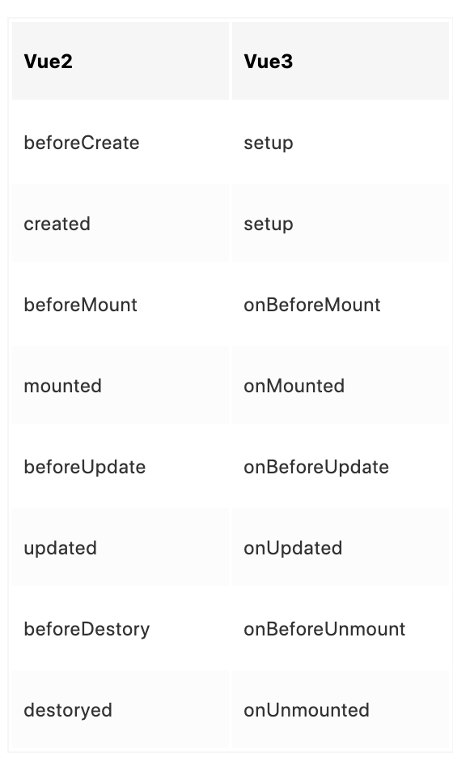

# Vue 3 + Vite

This template should help get you started developing with Vue 3 in Vite. The template uses Vue 3 `<script setup>` SFCs, check out the [script setup docs](https://v3.vuejs.org/api/sfc-script-setup.html#sfc-script-setup) to learn more.

## vue3生命周期

## 学习vue3资料
https://juejin.cn/post/6897030228867022856
https://github.com/vincentzyc/vue3-demo

